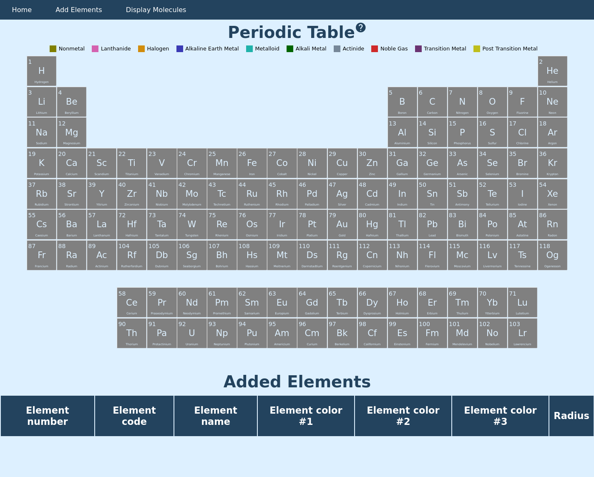
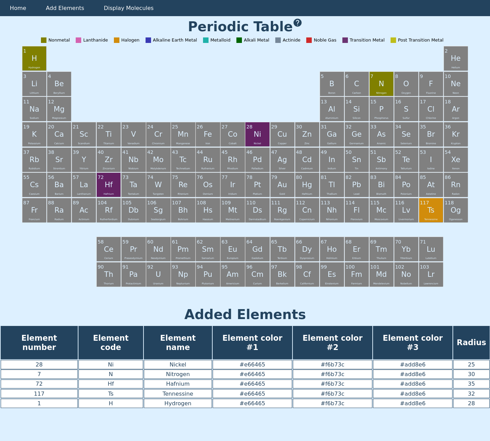
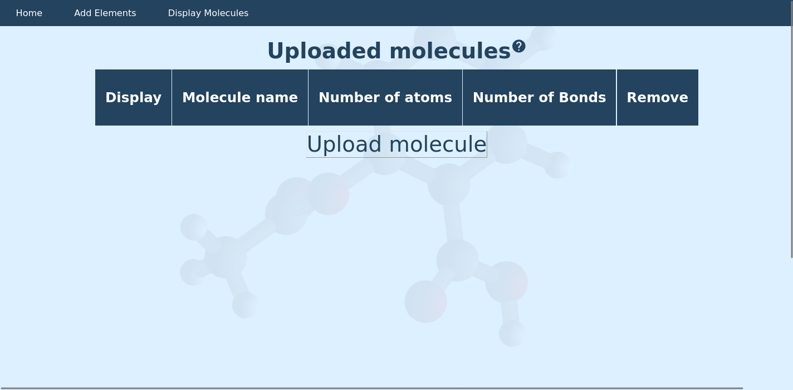
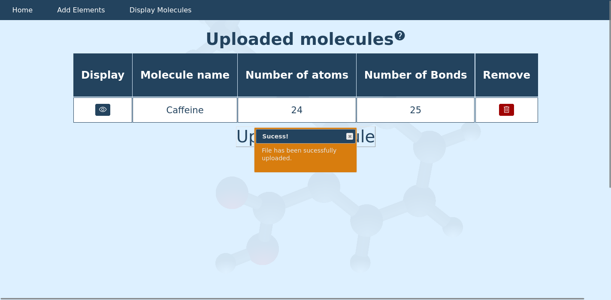
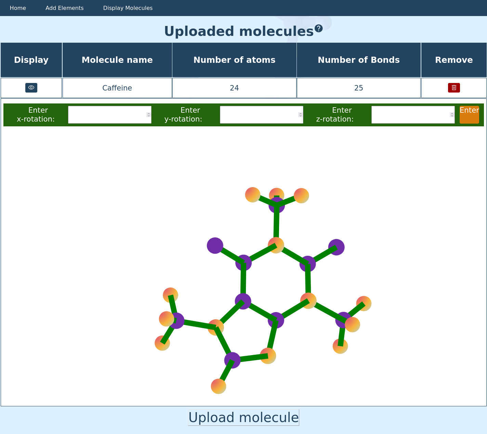

# Author Information
- Myron Ladyjenko

# Required setup to run the application
1. Please install swig and python3. Please ensure that the version of swig is above 3.0.1 and is compatible with your version of Python.
2. Next, clone the repository and compile the code by running the following command:
```
 make  
```  
3. Next, start the server by executing the following command:
```
python3 server.py [your_port_number]
```
# Application functionality
- The molecule viewer website is a Full-stack application built using C, Python, Javascript, sqlite3 and CSS/HTML.
  The website supports the following functionality:
  1. Addition/removal of elements using interactive 'Periodic Table'
  2. Addition/removal of molecules through SDF files with proper validation 
  3. View of the molecules and their rotation around the X, Y and Z axis.

# Application overview
- Here are sample screenshots from the Molecule-Viewer website:  
  -
  
  -
    
  -
    
  -
    
  -
    
  -
    
  -
    

